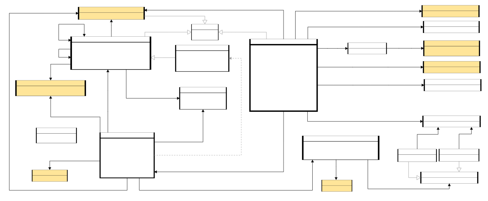

# ORG-EP

This is the issue tracker for the maintenance of ORG-EP.

ORG-EP is an application profile of the [W3C Organization Ontology](https://www.w3.org/TR/vocab-org/), designed and used for data of the European Parliament.

## Versions
- Latest version:
  - [HTML](index.html)
  - [SHACL](org-ep.shacl.ttl)
- [Version 0.3.1](0.3.1/)
- [Version 1.0](1.0/)

## ORG-EP at a glance

## Licence

ORG-EP is distributed under the terms and conditions described in the [European Parliament Legal Notice](https://www.europarl.europa.eu/legal-notice/).
